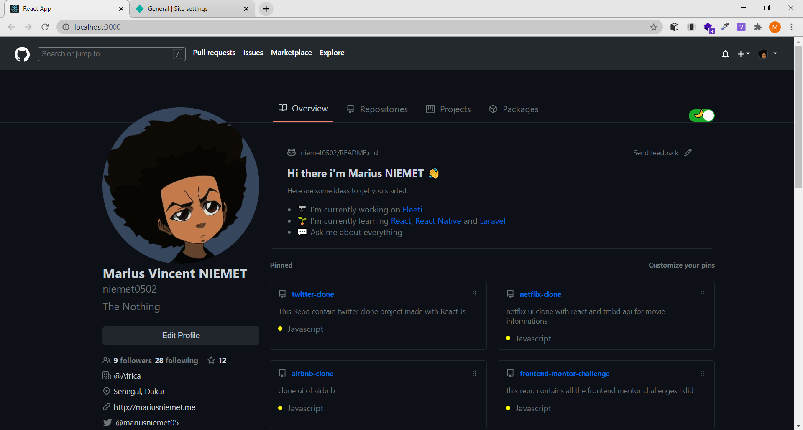
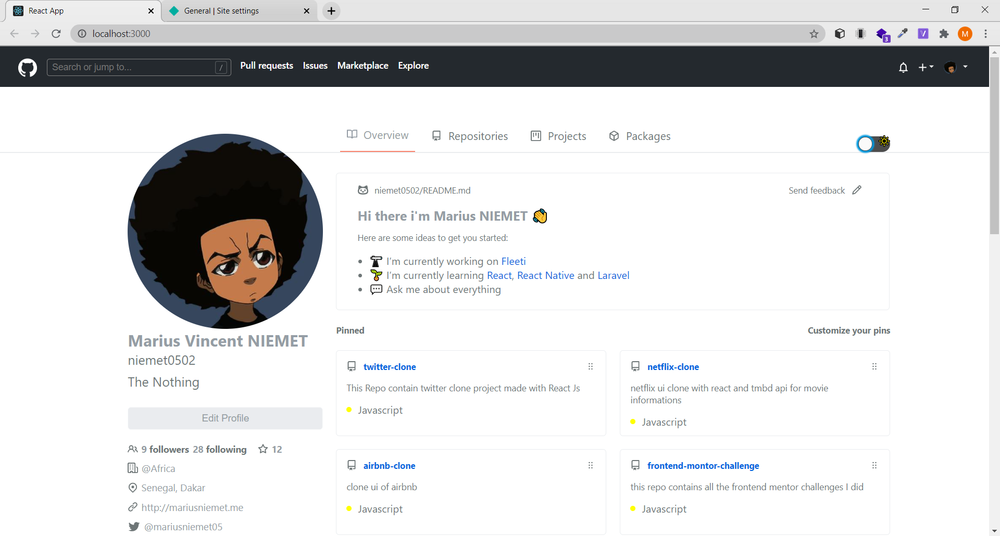

# This Repo contain Github Clone made with React js


## Installation

* Clone this repo:

```bash
git clone https://github.com/niemet0502/github-clone.git
```

* Change directory to the project

```bash
cd github-clone
```

* Install dependencies

```bash
npm install or yarn install
```

* launch project`

```bash
npm start
```

* APP
<br>

<br>

<a href="https://twitter-clone-mar.netlify.app/" target="_blank">Live</a>
